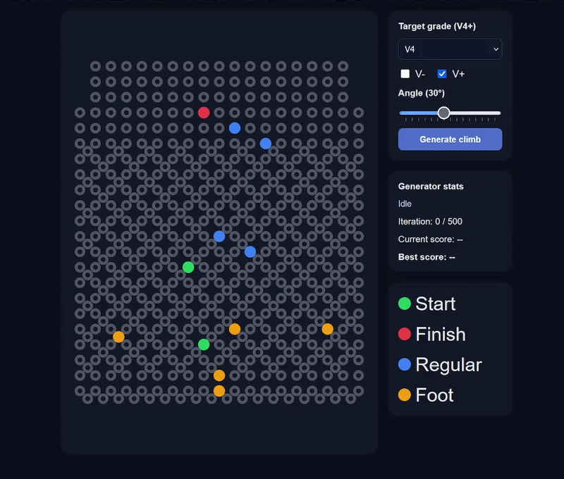
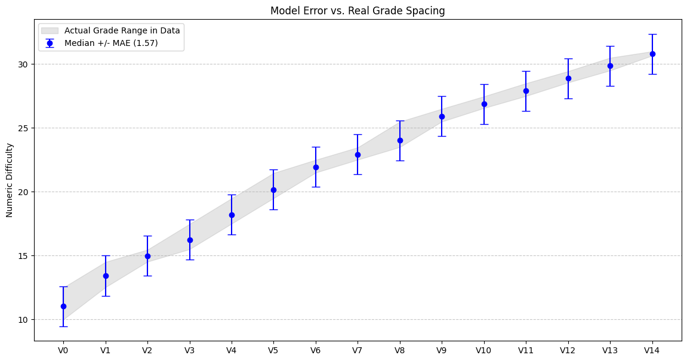
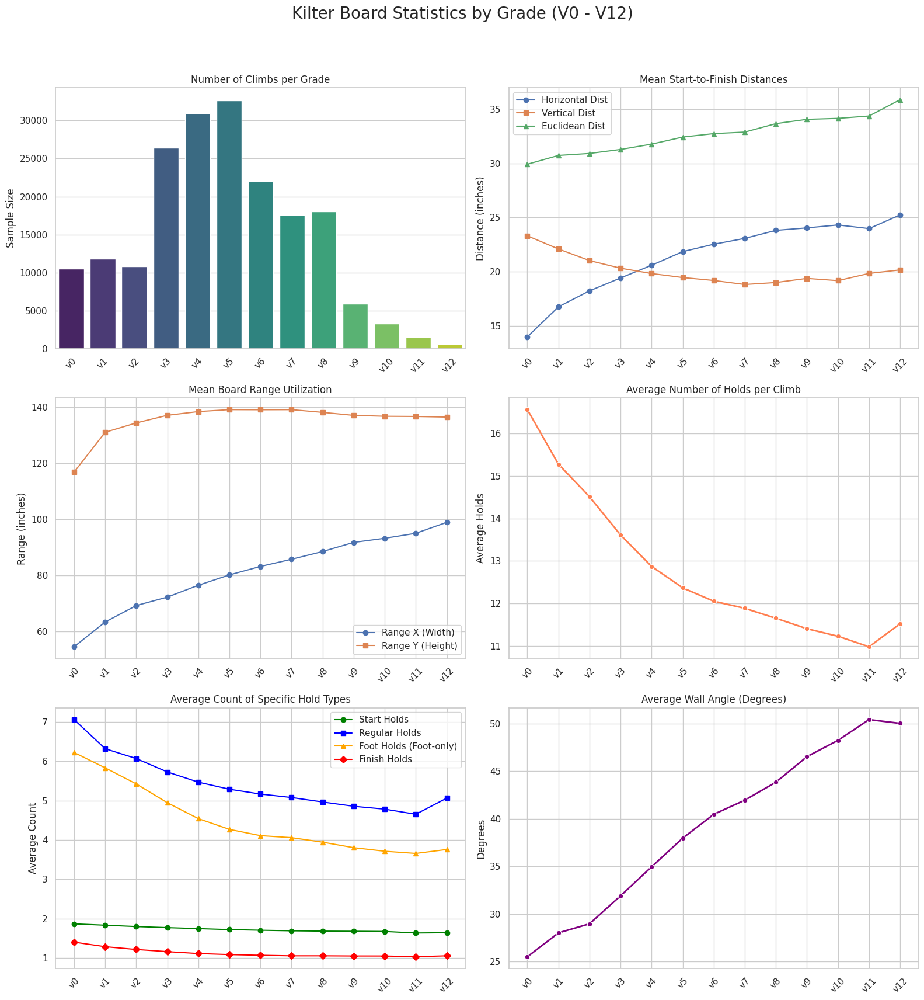

# Kilterboard Problem Generator
## Generate a Kilter problem at any grade and angle you want! 
#### (no guarantee it'll be good!)



## Summary
The Kilterboard Problem Generator works in 2 phases: generation and evaluation.
<br>
The generation phase creates a candidate problem using statistical distributions from a public dataset.
<br>
The evaluation phase is split into two parts: a machine learning model that predicts difficulty, 
and a deterministic model that scores the climb on how realistic it is.
<br>
The board visualization then updates in realtime as iterations of the generator run, 
keeping the best scoring candidate on screen.

## Model Accuracy
### Validation MAE: 1.5673
Exact Grade (± 0): 32.46%
<br>
Within ± 1 Grade:  77.57%
<br>
Within ± 2 Grades: 94.10%
<br>
<br>
The smaller the gray area is on the graph, the less likely the model is to be correct.



## Dataset Statistics 
### Dataset Credit: [Vilin97/KilterBoard](https://huggingface.co/datasets/Vilin97/KilterBoard)



## Compile Instructions
Clone repo, then open terminal in the root directory and run:
```bash
cd web
npm install
npm run dev
```
